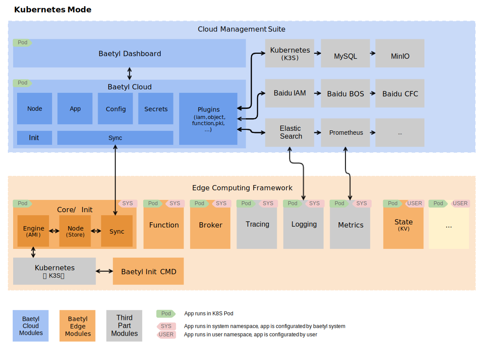

# BAETYL v2

[](https://baetyl.io)

[](https://github.com/baetyl/baetyl-cloud/actions?query=workflow%3Abuild)
[](https://codecov.io/gh/baetyl/baetyl-cloud)
[](https://goreportcard.com/report/github.com/baetyl/baetyl-cloud) 
[](LICENSE) 
[](Stars)

[](./README_CN.md) 

**[Baetyl](https://baetyl.io) is an open edge computing framework of
[Linux Foundation Edge](https://www.lfedge.org) that extends cloud computing,
data and service seamlessly to edge devices.** It can provide temporary offline, low-latency computing services include device connection, message routing, remote synchronization, function computing, video capture, AI inference, status reporting, configuration ota etc.

Baetyl v2 provides a new edge cloud integration platform, which adopts cloud management and edge operation solutions, and is divided into [**Edge Computing Framework**](https://github.com/baetyl/baetyl) and [**Cloud Management Suite (this project)**](https://github.com/baetyl/baetyl-cloud) supports varius deployment methods. It can manage all resources in the cloud, such as nodes, applications, configuration, etc., and automatically deploy applications to edge nodes to meet various edge computing scenarios. It is especially suitable for emerging strong edge devices, such as AI all-in-one machines and 5G roadside boxes.

The main differences between v2 and v1 versions are as follows:
* Edge and cloud frameworks have all evolved to cloud native, and already support running on K8S or K3S.
* Introduce declarative design, realize data synchronization (OTA) through shadow (Report/Desire).
* The edge framework does not support native process mode currently. Since it runs on K3S, the overall resource overhead will increase.
* The edge framework will support edge node clusters in the future.

## Architecture



### [Cloud Management Suite (this project)](./README.md) 

The Cloud Management Suite is responsible for managing all resources, including nodes, applications, configuration, and deployment. The realization of all functions is plug-in, which is convenient for function expansion and third-party service access, and provides rich applications. The deployment of the cloud management suite is very flexible. It can be deployed on public clouds, private cloud environments, and common devices. It supports K8S/K3S deployment, and supports single-tenancy and multi-tenancy.

The basic functions provided by the cloud management suite in this project are as follows:
* Edge node management
     * Online installation of edge computing framework
     * Synchronization (shadow) between edge and cloud
     * Node information collection
     * Node status collection
     * Application status collection
* Application deployment management
     * Container application
     * Function application
     * Node matching (automatic)
* Configuration management
     * Common configuration
     * Function configuration
     * Secrets
     * Certificates
     * Registry credentials

_The open source version contains the RESTful API of all the above functions, but does not include the front-end dashboard._

### [Edge Computing Framework](https://github.com/baetyl/baetyl)

The Edge Computing Framework runs on Kubernetes at the edge node,
manages and deploys all applications which provide various capabilities.
Applications include system applications and common applications.
All system applications are officially provided by Baetyl,
and you do not need to configure them.

There are currently several system applications:
* baetyl-init: responsible for activating the edge node to the cloud
and initializing baetyl-core, and will exit after all tasks are completed.
* baetyl-core: responsible for local node management (node),
data synchronization with cloud (sync) and application deployment (engine).
* baetyl-function: the proxy for all function runtime services,
function invocations are passed through this module.

Currently the framework supports Linux/amd64, Linux/arm64, Linux/armv7,
If the resources of the edge nodes are limited,
consider to use the lightweight kubernetes: [K3S](https://k3s.io/).

## Installation

Please download the baetyl-cloud project before installation. We take the scripts/demo in the project as an example to demonstrate the steps. The cloud management suite and the edge computing framework are all installed on the same machine.

```shell
git clone https://github.com/baetyl/baetyl-cloud.git
```

### Prepare database

Before installing baetyl-cloud, you should prepare a database(mysql or mariadb both meets the requirements)

Modify `sync-server-address` and `init-server-address` for table `baetyl_property` in the sql file *scripts/sql/data.sql* to set your own profile.

```yaml
sync-server-address : https://${host-ip}:30005
init-server-address : https://${host-ip}:30003
```

Import the sql file *scripts/sql/tables.sql* to create tables and the file *scripts/sql/data.sql* to initialize settings.

Enter your database information in the setting file *scripts/charts/baetyl-cloud/conf/cloud.yml*

```yaml
database:
type: "mysql"
url: "${database_username}:${database_password}@(${database_ip}:3306)/baetyl_cloud?charset=utf8&parseTime=true"
```

### Install baetyl-cloud

Enter the directory where the baetyl-cloud project is located and execute the following commands.

```shell
# helm 3
cd scripts/charts
kubectl apply -f ./baetyl-cloud/apply/
helm install baetyl-cloud ./baetyl-cloud/
```
Make sure that baetyl-cloud is in the Running state, and you can also check the log for errors.

```shell
kubectl get pod
# NAME                            READY   STATUS    RESTARTS   AGE
# baetyl-cloud-57cd9597bd-z62kb   1/1     Running   0          97s

kubectl logs -f baetyl-cloud-57cd9597bd-z62kb
```

### Create and install edge node

Call the RESTful API to create a node.

```shell
curl -d "{\"name\":\"demo-node\"}" -H "Content-Type: application/json" -X POST http://0.0.0.0:30004/v1/nodes
# {"namespace":"baetyl-cloud","name":"demo-node","version":"1931564","createTime":"2020-07-22T06:25:05Z","labels":{"baetyl-node-name":"demo-node"},"ready":false}
```

Obtain the online installation script of the edge node.

```shell
curl http://0.0.0.0:30004/v1/nodes/demo-node/init
# {"cmd":"curl -skfL 'https://0.0.0.0:30003/v1/active/setup.sh?token=f6d21baa9b7b2265223a333630302c226b223a226e6f6465222c226e223a2264656d6f2d6e6f6465222c226e73223a2262616574796c2d636c6f7564222c227473223a313539353430323132367d' -osetup.sh && sh setup.sh"}
```

Execute the installation script on the machine where baetyl-cloud is deployed.

```shell
curl -skfL 'https://0.0.0.0:30003/v1/active/setup.sh?token=f6d21baa9b7b2265223a333630302c226b223a226e6f6465222c226e223a2264656d6f2d6e6f6465222c226e73223a2262616574796c2d636c6f7564222c227473223a313539353430323132367d' -osetup.sh && sh setup.sh
```

**Note**:

1、 The K3s environment needs to be configured before the edge node installation. For details, please refer to [k3s installation](https://docs.rancher.cn/docs/k3s/installation/install-options/_index/). K3s runs in Containerd runtime  by default, when you want to switch to Docker runtime, please install Docker first, refer to [docker installation](http://get.daocloud.io/#install-docker)

2、If you need to install an edge node on a device other than the machine where baetyl-cloud is deployed, please modify the database, change the node-address and active-address in the baetyl_property table to real addresses.

Check the status of the edge node. Eventually, two edge services will be in the Running state. You can also call the cloud RESTful API to view the edge node status. You can see that the edge node is online ("ready":true).

```shell
kubectl get pod -A
# NAMESPACE            NAME                                      READY   STATUS    RESTARTS   AGE
  baetyl-edge-system   baetyl-broker-78f897dd65-dg5hp            1/1     Running       0      75s
  baetyl-edge-system   baetyl-core-77976446d9-pzbt7              1/1     Running       0      89s
  baetyl-edge-system   baetyl-init-7fdd9bcf96-klbpt              1/1     Running       0      102s

curl http://0.0.0.0:30004/v1/nodes/demo-node
# {"namespace":"baetyl-cloud","name":"demo-node","version":"1939112",...,"report":{"time":"2020-07-22T07:25:27.495362661Z","sysapps":...,"node":...,"nodestats":...,"ready":true}
```

## Contact us

As the first open edge computing framework in China,
Baetyl aims to create a lightweight, secure,
reliable and scalable edge computing community
that will create a good ecological environment.
In order to create a better development of Baetyl,
if you have better advice about Baetyl, please contact us:

- Welcome to join [Baetyl's Wechat](https://baetyl.bj.bcebos.com/Wechat/Wechat-Baetyl.png)
- Welcome to join [Baetyl's LF Edge Community](https://lists.lfedge.org/g/baetyl/topics)
- Welcome to send email to <baetyl@lists.lfedge.org>
- Welcome to [submit an issue](https://github.com/baetyl/baetyl/issues)

## Contributing

If you are passionate about contributing to open source community,
Baetyl will provide you with both code contributions and document contributions.
More details, please see: [How to contribute code or document to Baetyl](./docs/contributing.md).
