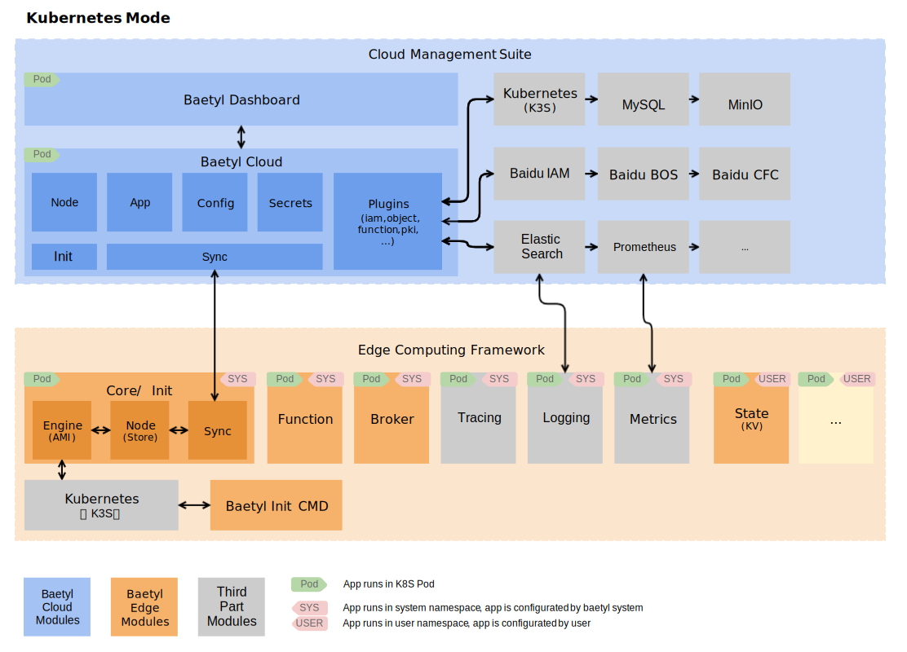

# BAETYL v2

[](https://baetyl.io)

[](https://github.com/baetyl/baetyl-cloud/actions?query=workflow%3Abuild)
[](https://codecov.io/gh/baetyl/baetyl-cloud)
[](https://goreportcard.com/report/github.com/baetyl/baetyl-cloud) 
[](LICENSE) 
[](Stars)

[](./README.md) 

**[Baetyl](https://baetyl.io) 是 [Linux Foundation Edge](https://www.lfedge.org) 
旗下的边缘计算项目，旨在将云计算能力拓展至用户现场**。
提供临时离线、低延时的计算服务，包括设备接入、消息路由、数据遥传、函数计算、视频采集、AI推断、状态上报、配置下发等功能。

Baetyl v2 提供了一个全新的边云融合平台，采用云端管理、边缘运行的方案，分成[**边缘计算框架**](https://github.com/baetyl/baetyl)和[**云端管理套件（本项目）**](https://github.com/baetyl/baetyl-cloud)两部分，支持多种部署方式。可在云端管理所有资源，比如节点、应用、配置等，自动部署应用到边缘节点，满足各种边缘计算场景，特别适合新兴的强边缘设备，比如 AI 一体机、5G 路侧盒子等。

v2 和 v1 版本的主要区别如下：
* 边缘和云端框架全部向云原生演化，已支持运行在 K8S 或 K3S 之上。
* 引入声明式的设计，通过影子（Report/Desire）实现端云同步（OTA）。
* 边缘框架暂不支持进程（native）运行模式，由于运行在 K3S 上，所以整体的资源开销会有增加。
* 边缘框架将来会支持边缘节点集群。

## 架构



### [云端管理套件（本项目）](./README_CN.md) 

云端管理套件（Cloud Management Suite）负责管理所有资源，包括节点、应用、配置、部署等。所有功能的实现都插件化，方便功能扩展和第三方服务的接入，提供丰富的应用。云端管理套件的部署非常灵活，即可部署在公有云上，又可部署在私有化环境中，还可部署在普通设备上，支持 K8S/K3S 部署，支持单租户和多租户。

开源版云端管理套件提供的基础功能如下：
* 边缘节点管理
    * 在线安装
    * 端云同步（影子）
    * 节点信息
    * 节点状态
    * 应用状态
* 应用部署管理
    * 容器应用
    * 函数应用
    * 节点匹配（自动）
* 配置管理
    * 普通配置
    * 函数配置
    * 密文
    * 证书
    * 镜像库凭证

_开源版本包含上述所有功能的 RESTful API，暂不包含前端界面（Dashboard）。_

### [边缘计算框架](https://github.com/baetyl/baetyl)

边缘计算框架（Edge Computing Framework）运行在边缘节点的 Kubernetes 上，
管理和部署节点的所有应用，通过应用服务提供各式各样的能力。
应用包含系统应用和普通应用，系统应用全部由 Baetyl 官方提供，用户无需配置。

目前有如下几个系统应用：
* baetyl-init：负责激活边缘节点到云端，并初始化 baetyl-core，任务完成后就会退出。
* baetyl-core：负责本地节点管理（node）、端云数据同步（sync）和应用部署（engine）。
* baetyl-function: 所有函数运行时服务的代理模块，函数调用都到通过这个模块。

目前框架支持 Linux/amd64、Linux/arm64、Linux/armv7，
如果边缘节点的资源有限，可考虑使用轻量版 Kubernetes：[K3S](https://k3s.io/)。

## 快速安装

在安装前请先下载 baetyl-cloud 项目，我们以项目中的 scripts/demo 为例演示步骤，云端管理套件和边缘计算框架全部安装在同一台机器上。

```shell
git clone https://github.com/baetyl/baetyl-cloud.git
```

### 安装数据库

在安装 baetyl-cloud 之前，我们需要先安装数据库，可执行如下命令安装。

```shell
helm repo add bitnami https://charts.bitnami.com/bitnami
helm install mariadb --set auth.rootPassword=secretpassword,auth.database=baetyl_cloud bitnami/mariadb
helm install phpmyadmin bitnami/phpmyadmin 
```
**注意**：这里为了演示方便，我们 hardcode 了密码，请自行修改，可全局替换 secretpassword。

### 初始化数据

确认 mariadb 和 phpmyadmin 都进入 Runing 状态。

```shell
kubectl get pod
# NAME                            READY   STATUS             RESTARTS   AGE
# mariadb-master-0                1/1     Running            0          2m56s
# mariadb-slave-0                 1/1     Running            0          2m56s
# phpmyadmin-55f4f964d7-ctmxj     1/1     Running            0          117s
```

然后执行如下命令，保持终端不要退出。

```shell
export POD_NAME=$(kubectl get pods --namespace default -l "app=phpmyadmin,release=phpmyadmin" -o jsonpath="{.items[0].metadata.name}")
echo "phpMyAdmin URL: http://127.0.0.1:8080"
kubectl port-forward --namespace default svc/phpmyadmin 8080:80
```

然后用浏览器打开 http://127.0.0.1:8080/index.php， 服务器输入：mariadb，账号输入：root，密码输入：secretpassword。登录后选择数据库 baetyl-cloud，点击 SQL按钮，将 baetyl-cloud 项目下 scripts/sql 目录中的所有文件的 sql 语句输入到页面执行。如果执行没有报错，则数据初始化成功。

### 安装 baetyl-cloud

进入 baetyl-cloud 项目所在目录，执行如下命令。

```shell
# helm 3
cd scripts/charts/baetyl-cloud
kubectl apply -f ./apply/
helm install baetyl-cloud .
```

确认 baetyl-cloud 处于 Running 状态，也可查看日志是否报错。

```shell
kubectl get pod
# NAME                            READY   STATUS    RESTARTS   AGE
# baetyl-cloud-57cd9597bd-z62kb   1/1     Running   0          97s

kubectl logs -f baetyl-cloud-57cd9597bd-z62kb
```

### 创建和安装边缘节点

调用 RESTful API 创建节点。

```shell
curl -d "{\"name\":\"demo-node\"}" -H "Content-Type: application/json" -X POST http://0.0.0.0:30004/v1/nodes
# {"namespace":"baetyl-cloud","name":"demo-node","version":"1931564","createTime":"2020-07-22T06:25:05Z","labels":{"baetyl-node-name":"demo-node"},"ready":false}
```

获取边缘节点的在线安装脚本。

```shell
curl http://0.0.0.0:30004/v1/nodes/demo-node/init
# {"cmd":"curl -skfL 'https://0.0.0.0:30003/v1/active/setup.sh?token=f6d21baa9b7b2265223a333630302c226b223a226e6f6465222c226e223a2264656d6f2d6e6f6465222c226e73223a2262616574796c2d636c6f7564222c227473223a313539353430323132367d' -osetup.sh && sh setup.sh"}
```

在 baetyl-cloud 部署地机器上执行安装脚本.

```shell
curl -skfL 'https://0.0.0.0:30003/v1/active/setup.sh?token=f6d21baa9b7b2265223a333630302c226b223a226e6f6465222c226e223a2264656d6f2d6e6f6465222c226e73223a2262616574796c2d636c6f7564222c227473223a313539353430323132367d' -osetup.sh && sh setup.sh
```

**注意**：

1、边缘节点端安装前需配置K3s环境，具体参考 [k3s安装](https://docs.rancher.cn/docs/k3s/installation/install-options/_index/)，K3s默认运行在Containerd运行时，若想切换到Docker运行时，请先安装Docker，具体参考 [docker安装](http://get.daocloud.io/#install-docker)

2、如果需要在 baetyl-cloud 部署地机器以外的设备上安装边缘节点，请修改数据库将 baetyl_property 表中的 node-address 和 active-address 修改成真实的地址。

查看边缘节点的状态，最终会有两个边缘服务处于 Running 状态，也可调用云端 RESTful API 查看边缘节点状态，可以看到边缘节点已经在线（"ready":true）。

```shell
kubectl get pod -A
# NAMESPACE            NAME                                      READY   STATUS    RESTARTS   AGE
  baetyl-edge-system   baetyl-broker-78f897dd65-dg5hp            1/1     Running       0      75s
  baetyl-edge-system   baetyl-core-77976446d9-pzbt7              1/1     Running       0      89s
  baetyl-edge-system   baetyl-init-7fdd9bcf96-klbpt              1/1     Running       0      102s

curl http://0.0.0.0:30004/v1/nodes/demo-node
# {"namespace":"baetyl-cloud","name":"demo-node","version":"1939112",...,"report":{"time":"2020-07-22T07:25:27.495362661Z","sysapps":...,"node":...,"nodestats":...,"ready":true}
```

## ekuiper集成

BIE从v2.4.3版本开始集成了[eKuiper](https://github.com/lf-edge/ekuiper)，现在，你可以通过BIE的系统应用一键下发并运行
eKuiper:1.8.0-alpha.2版本，只需要在节点创建或修改时的sysApps字段中，新增'baetyl-ekuiper'字段即可。

下发的eKuiper将默认连接到baetyl-broker，这样，你就可以通过baetyl-broker作为输入源，利用eKuiper
的流式数据处理和规则引擎能力对边缘数据进行处理了。

## 联系我们

Baetyl 作为中国首发的开源边缘计算框架，
我们旨在打造一个 **轻量、安全、可靠、可扩展性强** 的边缘计算社区，
为边缘计算技术的发展和不断推进营造一个良好的生态环境。
为了更好的推进 Baetyl 的发展，如果您有更好的关于 Baetyl 的发展建议，
欢迎选择如下方式与我们联系。

- 欢迎加入 [Baetyl 边缘计算开发者社区群](https://baetyl.bj.bcebos.com/Wechat/Wechat-Baetyl.png)
- 欢迎加入 [Baetyl 的 LF Edge 讨论组](https://lists.lfedge.org/g/baetyl/topics)
- 欢迎发送邮件到：<baetyl@lists.lfedge.org>
- 欢迎到 [GitHub 提交 Issue](https://github.com/baetyl/baetyl-cloud/issues)

## 如何贡献

如果您热衷于开源社区贡献，Baetyl 将为您提供两种贡献方式，分别是代码贡献和文档贡献。
具体请参考 [如何向 Baetyl 贡献代码和文档](./docs/contributing_cn.md)。
